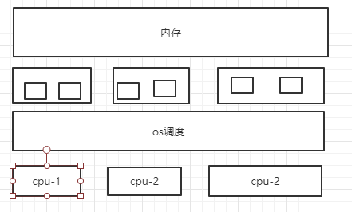
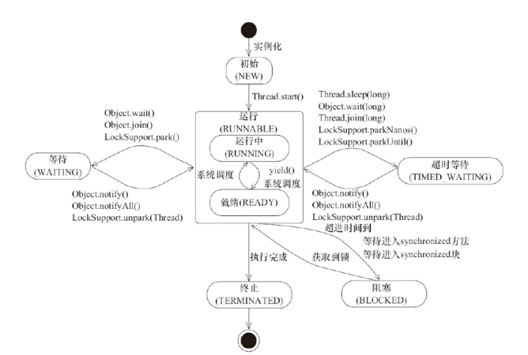
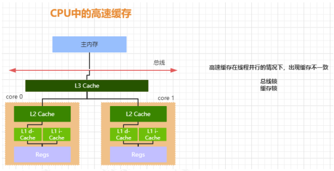
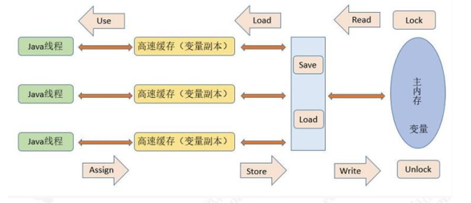

# java并发笔记

## 硬件架构模型图




## 什么时候使用多线程

1. 通过并行提高程序的性能
2. 网络等待，IO响应导致的延迟问题


## 应用多线程

### 继承Thread

> Thread 类本质上是实现了 Runnable 接口的一个实例，代表一个线程的实例。启动线程的唯一方法就是通过 Thread 类的 start()实例方法。start()方法是一个native 方法，它会启动一个新线程，并执行 run()方法。这种方式实现多线程很简单，通过自己的类直接 extend Thread，并复写 run()方法，就可以启动新线
> 程并执行自己定义的 run()方法


```java
public class MyThread extends Thread {

    public void run() {
        System.out.println("MyThread.run()");
    }

    public static void main(String[] args) {
        MyThread myThread1 = new MyThread();
        MyThread myThread2 = new MyThread();
        myThread1.start();
        myThread2.start();
    }
}
```


### 实现Runnable

```java
public class MyThread implements Runnable{

    public void run() {
        System.out.println("MyThread.run()");
    }

    public static void main(String[] args) {
        Thread myThread1 = new Thread(new MyThread());
        Thread myThread2 = new Thread(new MyThread());
        myThread1.start();
        myThread2.start();
    }
}
```


###  带返回值的ExecutorService、Callable、Future

>有的时候，我们可能需要让一步执行的线程在执行完成以后，提供一个返回值给到当前的主线程，主线程需要依赖这个值进行后续的逻辑处理，那么这个时候，就需要用到带返回值的线程了


```java
public class CallableDemo implements Callable<Boolean> {


    public static void main(String[] args) throws ExecutionException, InterruptedException {
        ExecutorService executorService =  Executors.newFixedThreadPool(6);
        Future<Boolean> future = executorService.submit(new CallableDemo());
        if(future.get()){
            System.out.println("线程执行成功");
        }
    }


    @Override
    public Boolean call() throws Exception {
        System.out.println("线程开始执行");
        System.out.println("线程执行结束");
        return true;
    }
}
```


## 并发编程基础

### 线程基础


#### 线程的状态

> BLOCKED:阻塞状态
>
> - 等待阻塞：运行的线程执行 wait 方法，jvm 会把当前线程放入到等待队列
>
> - 同步阻塞: 运行的线程在获取对象的同步锁时，若该同步锁被其他线程锁占
>   用了，那么 jvm 会把当前的线程放入到锁池中
>
> - 其他阻塞:运行的线程执行 Thread.sleep 或者 t.join 方法，或者发出了 I/O
>   请求时，JVM 会把当前线程设置为阻塞状态，当 sleep 结束、join 线程终止、
>   io 处理完毕则线程恢复

```java
public enum State {

        NEW,  //初始状态，线程被构建，但是还没有调用 start 方法

        RUNNABLE, //运行状态，JAVA 线程把操作系统中的就绪和运行两种状态统一称为“运行中”

        BLOCKED, //阻塞状态，表示线程进入等待状态,也就是线程因为某种原因放弃了 CPU 使用权，阻塞分为：等待阻塞，同步阻塞，其他阻塞

        WAITING, //等待状态

        TIMED_WAITING, //超时等待状态，超时以后自动返回

        TERMINATED; //终止状态，表示当前线程执行完毕
    }
```

 


#### 线程状态的演示

##### 代码演示

```java
public class ThreadStatus {

    public static void main(String[] args) {
        //TIME_WAITING
        new Thread(()->{
           while (true){
               try {
                   TimeUnit.SECONDS.sleep(1);
               } catch (InterruptedException e) {
                   e.printStackTrace();
               }
           }
        },"timewaiting").start();

        //WAITING，线程在 ThreadStatus 类锁上通过 wait 进行等待
        new Thread(()->{
            while(true){
                synchronized (ThreadStatus.class){
                    try {
                        ThreadStatus.class.wait();
                    } catch (InterruptedException e) {
                        e.printStackTrace();
                    }
                }
            }
        },"Waiting").start();

        //线程在 ThreadStatus 加锁后，不会释放锁
        new Thread(new BlockedDemo(),"BlockDemo-01").start();
        new Thread(new BlockedDemo(),"BlockDemo-02").start();

    }


    static class BlockedDemo extends Thread{
        public void run(){
            synchronized (BlockedDemo.class){
                while(true){
                    try {
                        TimeUnit.SECONDS.sleep(100);
                    } catch (InterruptedException e) {
                        e.printStackTrace();
                    }
                }
            }
        }
    }
}

```

##### 查看代码状态

通过相应命令显示线程状态 

> jps
>
> > 打开终端或者命令提示符，键入“jps”，（JDK1.5 提供的一个显示当前所有 java
> > 进程 pid 的命令），可以获得相应进程的 pid
>
> jstack
>
> > 根据上一步骤获得的 pid，继续输入 jstack pid（jstack 是 java 虚拟机自带的
> > 一种堆栈跟踪工具。jstack 用于打印出给定的 java 进程 ID 或 core file 或远程
> > 调试服务的 Java 堆栈信息）


#### 线程的停止

> 线程的启动过程大家都非常熟悉，但是如何终止一个线程，我相信绝大部分人在面试的时候被问到这个问题时，也会不知所措，不知道怎么回答。记住，线程的终止，并不是简单的调用 stop 命令去。虽然 api 仍然可以调用，但是和其他的线程控制方法如 suspend、resume 一样都是过期了的不建议使用，就拿 stop 来说，stop 方法在结束一个线程时并不会保证线程的资源正常释放，因此会导致程序可能出现一些不确定的状态。要优雅的去中断一个线程，在线程中提供了一个 interrupt 方法


##### interrupt  

###### interrupt的使用

###### isInterrupted的使用

>当其他线程通过调用当前线程的 interrupt 方法，表示向当前线程打个招呼，告诉他可以中断线程的执行了，至于什么时候中断，取决于当前线程自己。


> 线程通过 isInterrupted()来判断是否被中断。


  ```java
public class InterruptDemo {
    public  static  int count = 0;
    public static void main(String[] args) throws InterruptedException {
        Thread thread = new Thread(()->{
            while (!Thread.currentThread().isInterrupted()){
                count ++;
            }
            System.out.println(count);
        });
        thread.start();
        TimeUnit.SECONDS.sleep(2);
        thread.interrupt();
    }
}
  ```

> 这种通过标识位或者中断操作的方式能够使线程在终止时有机会去清理资源，而不是武断地将线程停止，因此这种终止线程的做法显得更加安全和优雅

 ###### 中断标识的线程复位

- Thread.interrupted

```java
public class InterruptDemo {

    public  static  int count = 0;

    public static void main(String[] args) throws InterruptedException {
        Thread thread = new Thread(()->{
            while (!Thread.currentThread().isInterrupted()){
                count ++;
            }
            System.out.println(count);
            System.out.println(Thread.currentThread().isInterrupted());//true
            Thread.interrupted();
            System.out.println(Thread.currentThread().isInterrupted()); //false
        });
        thread.start();
        TimeUnit.SECONDS.sleep(2);
        thread.interrupt();
    }

}
```


- 抛出 InterruptedException 异常


  ##### volatile控制线程的终止

```java
public class InterruptDemo {
    public  static  int count = 0;
    public static  volatile boolean stop = false;
    public static void main(String[] args) throws InterruptedException {
        Thread thread = new Thread(()->{
            while (!stop){
                count ++;
            }
            System.out.println(count);
        });
        thread.start();
        TimeUnit.SECONDS.sleep(2);
        stop = true;
    }
}
```

### 线程的安全性问题

> JDK层面的操作，是为了解决硬件层面的问题。
>
> JMM 屏蔽了操作系统，硬件等方面的差异，将多线程问题归结为java层面的可见性，原子性，有序性问题。

#### 可见性

> 内存屏障

##### 可见性演示

```java
public class InterruptDemo {
    public  static  int count = 0;
    public static  boolean stop = false; 
    //public static volatile   boolean stop = false;  //volatile保证可见性
    public static void main(String[] args) throws InterruptedException {
        Thread thread = new Thread(()->{
            while (!stop){
                count ++;
            }
            System.out.println(count);
        });
        thread.start();
        TimeUnit.SECONDS.sleep(2);
        stop = true;
    }
}
```


#### 有序性


#### 原子性

##### 原子性演示

```java
public class AtomicDemo {

    private static  int count  = 0;

    public   static void incr(){
        try {
            Thread.sleep(1000);
        } catch (InterruptedException e) {
            e.printStackTrace();
        }
       count ++;
    }
    public static void main(String[] args) throws InterruptedException {
       for(int i=0;i<1000;i++){
           new Thread(AtomicDemo::incr).start();
       }
       Thread.sleep(2000);
       System.out.println(count);
    }
}

```


### 硬件层面 


#### CPU的高速缓冲认识

> 绝大部分的运算任务不能只依靠处理器“计算”就能完成，处理器还需要与内存交互，比如读取运算数据、存储运算结果。而由于计算机的存储设备与处理器的运算速度差距非常大，所以现代计算机系统都会增加一层读写速度尽可能接近处理器运算速度的高速缓存来作为内存和处理器之间的缓冲：将运算需要使用的数据复制到缓存中，让运算能快速进行，当运算结束后再从缓存同步到内存之中。

##### CPU的高速缓冲图例



> - 高速缓存从下到上越接近 CPU 速度越快，同时容量也越小。
> - 现在大部分的处理器都有二级或者三级缓存，从下到上依次为 L3 cache, L2 cache, L1 cache.
> - L1 cache 缓存又可以分为指令缓存和数据缓存，指令缓存用来缓存程序的代码，数据缓存
>   用来缓存程序的数据


#### CPU的高速缓冲产生的问题

##### 缓冲一致性问题

> CPU-0 读取主存的数据，缓存到 CPU-0 的高速缓存中，CPU-1 也做了同样的事情，而 CPU-1 把 count 的值修改成了 2，并且同步到 CPU-1 的高速缓存，但是这个修改以后的值并没有写入到主存中，CPU-0 访问该字节，由于缓存没有更新，所以仍然是之前的值，就会导致数据不一致的问题

###### 总线锁(lock信号锁总线)

> 当一个 CPU 对其缓存中的数据进行操作的时候，往总线中发送一个 Lock 信号。其他处理器的请求将会被阻塞，那么该处理器可以独占共享内存。总线锁相当于把 CPU 和内存之间的通信锁住了，所以这种方式会导致 CPU 的性能下降，所以 P6 系列以后的处理器，出现了另外一种方式，就是缓存锁。


###### 缓存锁(lock信号锁缓存)

> 如果缓存在处理器缓存行中的内存区域在 LOCK 操作期间被锁定，当它执行锁
> 操作回写内存时，处理不在总线上声明 LOCK 信号，而是修改内部的缓存地
> 址，然后通过缓存一致性机制来保证操作的原子性，因为缓存一致性机制会阻
> 止同时修改被两个以上处理器缓存的内存区域的数据，当其他处理器回写已经
> 被锁定的缓存行的数据时会导致该缓存行无效。
> 所以如果声明了 CPU 的锁机制，会生成一个 LOCK 指令，会产生两个作用

- Lock 前缀指令会引起引起处理器缓存回写到内存，在 P6 以后的处理器中，
  LOCK 信号一般不锁总线，而是锁缓存

- 一个处理器的缓存回写到内存会导致其他处理器的缓存无效

###### 缓存一致性协议(MESI)(嗅探协议)

> 处理器上有一套完整的协议，来保证 Cache 的一致性，比较经典的应该就是
> MESI 协议了，它的方法是在 CPU 缓存中保存一个标记位，这个标记为有四种
> 状态

1. M(Modified) 修改缓存，当前 CPU 缓存已经被修改，表示已经和内存中的
   数据不一致了
2. I(Invalid) 失效缓存，说明 CPU 的缓存已经不能使用了
3. E(Exclusive) 独占缓存，当前 cpu 的缓存和内存中数据保持一直，而且其他
   处理器没有缓存该数据
4. S(Shared) 共享缓存，数据和内存中数据一致，并且该数据存在多个 cpu
   缓存中

####  硬件层面-CPU  的优化执行

> 除了增加高速缓存以为，为了更充分利用处理器内内部的运算单元，处理器可
> 能会对输入的代码进行乱序执行优化，处理器会在计算之后将乱序执行的结果
> 充足，保证该结果与顺序执行的结果一直，但并不保证程序中各个语句计算的
> 先后顺序与输入代码中的顺序一致，这个是处理器的优化执行；还有一个就是
> 编程语言的编译器也会有类似的优化，比如做指令重排来提升性能。

### 应用层面

#### JMM内存模型概要

> 内存模型定义了共享内存系统中多线程程序读写操作行为的规范，来屏蔽各种硬件和操作系统的内存访问差异，来实现 Java 程序在各个平台下都能达到一致的内存访问效果。

##### 主要手段

- 限制处理器优化
- 使用内存屏障

#### JMM内存模型图例

> Java 内存模型定义了线程和内存的交互方式



##### 图例概念解读

###### 内存分类

- 主内存

> 主内存是所有线程共享的

- 工作内存

> 工作内存是每个线程独有的

###### 共享变量

> 存放在堆内存的变量

- 实例对象
- 静态字段
- 数组对象

###### 变量操作限制

- 线程对变量的所有操作（读取、赋值）都必须在工作内存中进行，不能直接读写主内存中的变量

###### 线程间变量隔离限制

- 并且不同的线程之间无法访问对方工作内存中的变量，线程间的变量值的传递都需要通过主内存来完成

###### 开放式的LOCK

- monitorenter
- volatile