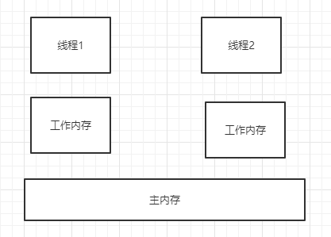

# JMM


## 多线程之间的通信

#### 共享内存



#### 消息传递

> wait()/notify()


## JMM产生的问题

#### 问题1-可见性

> 工作内存的值，什么时候同步到主内存


> 主内存什么时候同步到工作内存中


#### 问题2-原子性

> 主内存什么时候同步到工作内存中


#### 问题2-有序性

> - 编译器重排序
> - 处理器重排序
> - 内存系统重排序

## JMM与物理硬件之间的映射


## 解决原子性、可见性、有序性

> 在Java中提供了一系列和并发处理相关的关键字，比如volatile、Synchronized、final、juc等，这些就是Java内存模型封装了底层的实现后提供给开发人员使用的关键字

> 原子性：Synchronized 
>
> > monitorenter
> >
> > monitorexit
>
> 可见性：
>
> > volatile : 被其修饰的变量在被修改后可以立即同步到主内存，被其修饰的变量在每次是用之前都从主内存刷新。因此，可以使用volatile来保证多线程操作时变量的可见性。
> >
> > Synchronized 
> >
> >  final
>
> 有序性：使用synchronized和volatile来保证多线程之间操作的有序性
>
> > volatile:禁止指令重排
> >
> > Synchronized:保证同一时刻只允许一条线程操作


# volatile 

## 保证可见性

#### 查看lock汇编指令

1. 下载hsdis工具 ，https://sourceforge.net/projects/fcml/files/fcml-1.1.1/hsdis-1.1.1-win32-amd64.zip/download

2. 解压后存放到jre目录的server路径下

3. 然后跑main函数，跑main函数之前，加入如下虚拟机参数：

   ```java
   -server -Xcomp -XX:+UnlockDiagnosticVMOptions -XX:+PrintAssembly -XX:CompileCommand=compileonly,*App.getInstance（替换成实际运行的代码）
   ```

#### lock的作用

> volatile变量修饰的共享变量，在进行写操作的时候会多出一个lock前缀的汇编指令，这个指令在前面我们讲解CPU高速缓存的时候提到过，会触发总线锁或者缓存锁，通过缓存一致性协议来解决可见性问题对于声明了volatile的变量进行写操作，JVM就会向处理器发送一条Lock前缀的指令，把这个变量所在的缓存行的数据写回到系统内存，再根据我们前面提到过的MESI的缓存一致性协议，来保证多CPU下的各个高速缓存中的数据的一致性。

## 防止指令重排序

