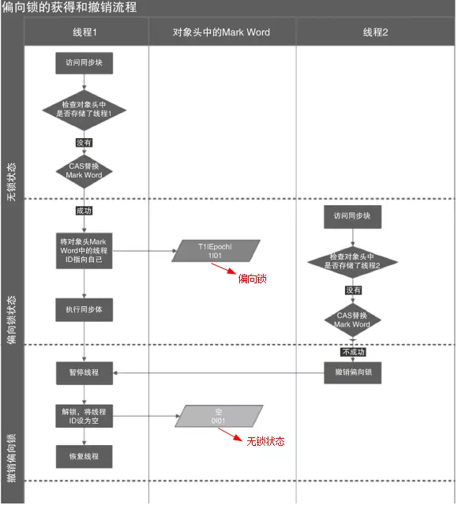

# JMM


## 多线程之间的通信

#### 共享内存


#### 消息传递

> wait()/notify()


## JMM产生的问题

#### 问题1-可见性

> 工作内存的值，什么时候同步到主内存


> 主内存什么时候同步到工作内存中


#### 问题2-原子性

> 主内存什么时候同步到工作内存中


#### 问题2-有序性

> - 编译器重排序
> - 处理器重排序
> - 内存系统重排序

## JMM与物理硬件之间的映射


## 解决原子性、可见性、有序性

> 在Java中提供了一系列和并发处理相关的关键字，比如volatile、Synchronized、final、juc等，这些就是Java内存模型封装了底层的实现后提供给开发人员使用的关键字

> 原子性：Synchronized ，CAS, AQS
>
> > monitorenter
> >
> > monitorexit 
>
> 可见性：
>
> > volatile : 被其修饰的变量在被修改后可以立即同步到主内存，被其修饰的变量在每次是用之前都从主内存刷新。因此，可以使用volatile来保证多线程操作时变量的可见性。
> >
> > Synchronized 
> >
> >  final
>
> 有序性：使用synchronized和volatile来保证多线程之间操作的有序性
>
> > volatile:禁止指令重排
> >
> > Synchronized:保证同一时刻只允许一条线程操作


# volatile 

## 保证可见性

#### 查看lock汇编指令

1. 下载hsdis工具 ，https://sourceforge.net/projects/fcml/files/fcml-1.1.1/hsdis-1.1.1-win32-amd64.zip/download

2. 解压后存放到jre目录的server路径下

3. 然后跑main函数，跑main函数之前，加入如下虚拟机参数：

   ```java
   -server -Xcomp -XX:+UnlockDiagnosticVMOptions -XX:+PrintAssembly -XX:CompileCommand=compileonly,*App.getInstance（替换成实际运行的代码）
   ```

#### lock的作用

> volatile变量修饰的共享变量，在进行写操作的时候会多出一个lock前缀的汇编指令，这个指令在前面我们讲解CPU高速缓存的时候提到过，会触发总线锁或者缓存锁，通过缓存一致性协议来解决可见性问题对于声明了volatile的变量进行写操作，JVM就会向处理器发送一条Lock前缀的指令，把这个变量所在的缓存行的数据写回到系统内存，再根据我们前面提到过的MESI的缓存一致性协议，来保证多CPU下的各个高速缓存中的数据的一致性。

## 防止指令重排序

#### 指令重排序代码演示

> 1. x=1  y=1
> 2. x=0  y=1
> 3. x=1 y=0
> 4. x=0  y=0

```java
public class VolatileDemo {

    private static int x=0;
    private static int y=0;
    private static int a=0;
    private static int b=0;

    public static void main(String[] args) throws InterruptedException {
      Thread t1 = new Thread(()->{
           a=1;
           x=b;
        });
        Thread t2 =  new Thread(()->{
            b=1;
            y=a;
        });
        t1.start();
        t2.start();
        t1.join(); //等待线程执行结果
        t2.join();//等待线程执行结果
        System.out.println("x="+y+"  "+"y="+y);
    }

}

```

#### 存在的问题

- 编译器的指令重排序   

  > 解决办法：优化屏障		 

- 处理器的指令重排序

  > 解决办法：内存屏障

#### 防止CPU的指令重排序--内存屏障

>  现在的CPU架构都提供了内存屏障功能，在x86的cpu中，实现了相应的内存屏障
>
> - 写屏障(store barrier)
>
> - 读屏障(load barrier)
>
> - 全屏障(Full Barrier)
>
>   主要的作用是
>
>   > - 防止指令之间的重排序
>
>   > - 保证数据的可见性

##### store barrier

> store barrier称为写屏障，相当于storestore barrier,
>
> > 强制所有在storestore内存屏障之前的所有执行，都要在该内存屏障之前执行，并发送缓存失效的信号。
> >
> > 所有在storestore barrier指令之后的store指令，都必须在storestore barrier屏障之前的指令执行完后再被执行。也就是禁止了写屏障前后的指令进行重排序。
> >
> > store barrier之前发生的内存更新都是可见的（这里的可见指的是修改值可见以及操作结果可见）。


##### load barrier

> load barrier称为读屏障，相当于loadload barrier。
>
> > 强制所有在load barrier读屏障之后的load指令，都在loadbarrier屏障之后执行。
> >
> > 也就是禁止对load barrier读屏障前后的load指令进行重排序。
> >
> > 配合store barrier，使得所有store barrier之前发生的内存更新，对load barrier之后的load操作是可见的。


##### Full Barrier

> full barrier成为全屏障，相当于storeload
>
> > 是一个全能型的屏障，因为它同时具备前面两种屏障的效果。强制了所有在storeload barrier之前的store/load指令，都在该屏障之前被执行，
> >
> > 所有在该屏障之后的的store/load指令，都在该屏障之后被执行。禁止对storeload屏障前后的指令进行重排序。


##### 总结

> 内存屏障只是解决顺序一致性问题，不解决缓存一致性问题，缓存一致性是由cpu的缓存锁以及MESI协议来完成的。而缓存一致性协议只关心缓存一致性，不关心顺序一致性。


#### 编译器层面防止指令重排序---(优化屏障)

>在编译器层面，通过volatile关键字，取消编译器层面的缓存和重排序。保证编译程序时在优化屏障之前的指令不会在优化屏障之后执行。这就保证了编译时期的优化不会影响到实际代码逻辑顺序。

> 如果硬件架构本身已经保证了内存可见性，那么volatile就是一个空标记，不会插入相关语义的内存屏障。如果硬件架构本身不进行处理器重排序，有更强的重排序语义，那么volatile就是一个空标记，不会插入相关语义的内存屏障。

> 在JMM中把内存屏障指令分为4类，通过在不同的语义下使用不同的内存屏障来禁止特定类型的处理器重排序，从而来保证内存的可见性


> 对每个volatile 写操作的前面插入  storestorebarriers
>
> 对每个volatile 写操作的后面插入 storeloadbarriers
>
> 对每个volatile 读操作的前面插入  laodlaodbarriers
>
> 对每个volatile 读操作的后面插入  loadstorebarriers

##### LoadLoad Barriers

> load1 ;     LoadLoad;      load2 
>
> > 确保load1数据的装载优先于load2及所有后续装载指令的装载


##### StoreStore Barriers

> store1; storestore;store2 
>
> > 确保store1数据对其他处理器可见优先于store2及所有后续存储指令的存储


##### LoadStore Barries 

> load1;loadstore;store2
>
> > 确保load1数据装载优先于store2以及后续的存储指令刷新到内存


##### StoreLoad Barries

> store1; storeload;load2
>
> > 确保store1数据对其他处理器变得可见， 优先于load2及所有后续装载指令的装载；这条内存屏障指令是一个全能型的屏障，在前面讲cpu层面的内存屏障的时候有提到。它同时具有其他3条屏障的效果


## volatile为什么不能保证原子性

> 无法保证复合操作的原子性

```java
public class Demo {
  volatile int i;
  public void incr(){
    i++;
 }
  public static void main(String[] args) {
    new Demo().incr();
 }
}
```

> 查看字节码,对一个原子递增的操作，会分为三个步骤：
>
> 1. getfield 
>
> >  读取volatile变量的值；
>
> 2. iadd
>
> > 增加变量的值；
>
> 3. putfield 
>
>    > 把值写回让其他线程可见


  通过内存屏障可以保证store与load的顺序

> loadA  loadB  storeA  storeB  可以保证  store能都在load指令前面或者后面执行。但是并不能保证loadA  ，storeA的连续执行
>
> 已i++ 为例，只能在一个线程store完毕之后才能对其他线程可见，否则其他线程得到的可能是旧的值。
>
>

# Synchronized 

> **Synchronized如何实现锁**
>
> **为什么每个对象都可以称为锁**

> 解决原子性，可见性，有序性
>
> 在多线程并发编程中synchronized一直是元老级角色，很多人都会称呼它为
>
> - **重量级锁**
>
> Java SE 1.6中为了减少获得锁和释放锁带来的性能消耗而引入的
>
> - **偏向锁 **
>
> - **轻量级锁**
>
> 以及锁的**存储结构**和**升级过程**。

## synchronized代码演示 

```java
public class Demo {
    private    static  int count  = 0;

    public  static void incr(){
        synchronized (Demo.class){
            try {
                Thread.sleep(1);
            } catch (InterruptedException e) {
                e.printStackTrace();
            }
            count ++;
        }

    }
    public static void main(String[] args) throws InterruptedException {
        for(int i=0;i<1000;i++){
            new Thread(Demo::incr).start();
        }
        Thread.sleep(4000);
        System.out.println(count);
    }
}
```

## synchronized的三种应用方式

####  静态方法

> 作用于当前类对象加锁，进入同步代码前要获得当前类对象的锁


> 全局锁 （Object.class）

```java
public class Demo {
    private    static  int count  = 0;

    public  static void incr(){
        synchronized (Demo.class){
            try {
                Thread.sleep(1);
            } catch (InterruptedException e) {
                e.printStackTrace();
            }
            count ++;
        }
    }
}
```

> 全局锁 （静态方法）

```java
public class Demo {
    private    static  int count  = 0;

    public  synchronized static void incr(){
            try {
                Thread.sleep(1);
            } catch (InterruptedException e) {
                e.printStackTrace();
            }
            count ++;
    }
}
```

> 全局锁（静态变量）

```java
public class Demo {
    private    static  int count  = 0;
    private Object lock = new Object();
    public  static void incr(){
        synchronized (lock){
            try {
                Thread.sleep(1);
            } catch (InterruptedException e) {
                e.printStackTrace();
            }
            count ++;
        }
    }
}
```


#### 修饰代码块


#### 修饰实例方法

```java
synchronized (this){
        try {
            Thread.sleep(1);
        } catch (InterruptedException e) {
            e.printStackTrace();
        }
        count ++;
    }
```

#### synchronized括号后面的对象

> synchronized括号后面的对象是一把锁
>
> - 在java中任意一个对象都可以成为锁
>
> 简单来说，我们把object比喻是一个key，拥有这个key的线程才能执行这个方法，拿到这个key以后在执行方法过程中，这个key是随身携带的，并且只有一把。如果后续的线程想访问当前方法，因为没有key所以不能访问只能在门口等着，等之前的线程把key放回去。所以，synchronized锁定的对象必须是同一个，如果是不同对象，就意味着是不同的房间的钥匙，对于访问者来说是没有任何影响的

#### synchronized在方法体上，在方法体里面javap的不同

##### 方法体上

> ACC_SYNCHRONIZED


##### 方法体里面

> - monitorenter
>
> - monitorexit


#### synchronized的字节码指令(monitorenter/monitorexit)

> 通过javap -v 来查看对应代码的字节码指令，对于同步块的实现使用了
>
> - monitorenter
> - monitorexit
>
> 前面我们在讲JMM的时候，提到过这两个指令，他们隐式的执行了
>
> - Lock
>
> - UnLock
>
> 用于提供原子性保证。
>
> - monitorenter指令插入到同步代码块开始的位置
>
> - monitorexit指令插入到同步代码块结束位置
>
> jvm需要保证每个monitorenter都有一个monitorexit对应。
>
> 这两个指令，本质上都是对一个对象的
>
> - 监视器(monitor)进行获取，这个过程是排他的
>
> 也就是说同一时刻只能有一个线程获取到由synchronized所保护对象的监视器线程执行到monitorenter指令时，会尝试获取对象所对应的monitor所有权，也就是尝试获取对象的锁；而执行monitorexit，就是释放monitor的所有权


#### synchronized的锁的原理

>  jdk1.6以后对synchronized锁进行了优化，包含
>
> - 偏向锁
>
> - 轻量级锁
>
> - 重量级锁 
>
> 在了解synchronized锁之前，我们需要了解两个重要的概念，一个是对象头、另一个是monitor

##### 锁存放在哪个地方(对象头)

> 对象在内存中的布局分为三块区域：
>
> - 对象头
>
> - 实例数据
>
> - 对齐填充
>
> Java对象头是实现synchronized的锁对象的**基础**，一般而言，synchronized使用的**锁对象是存储在Java对象头里**。它是轻量级锁和偏向锁的关键
>
> 对象头分为  mark work 与 Klass Pointer 


###### 对象头之mark work（标记字段）

> Mark Word用于存储对象自身的运行时数据，
>
> - 哈希码（HashCode）
>
> - GC分代年龄
>
> - 锁状态标志
>
> - 线程持有的锁
>
> - 偏向线程 ID
>
> - 偏向时间戳等等。
>
> Java对象头一般占有两个机器码（在32位虚拟机中，1个机器码等于4字节，也就是32bit）


> 32位


> 64位

###### mark work在JVM源码中的体现(oop.hpp)

> 如果想更深入了解对象头在JVM源码中的定义，需要关心几个文件，oop.hpp/markOop.hpp
> oop.hpp，每个 Java Object 在 JVM 内部都有一个 native 的 C++ 对象 oop/oopDesc 与之对应。先在oop.hpp中看oopDesc的定义

```c++

class oopDesc {
  friend class VMStructs;
 private:
  volatile markOop  _mark;
  union _metadata {
    wideKlassOop    _klass;
    narrowOop       _compressed_klass;
  } _metadata;
}
```


######  mark work在JVM源码中的体现(markOop.hpp)

> 从上面的枚举定义中可以看出，对象头中主要包含了GC分代年龄、锁状态标记、哈希码、epoch等信息。

   ```c++

enum { age_bits                 = 4,
      lock_bits                = 2,
      biased_lock_bits         = 1,
      max_hash_bits            = BitsPerWord - age_bits - lock_bits - biased_lock_bits,
      hash_bits                = max_hash_bits > 31 ? 31 : max_hash_bits,
      cms_bits                 = LP64_ONLY(1) NOT_LP64(0),
      epoch_bits               = 2
};
   ```


> 对象的状态一共有五种，分别是无锁态、轻量级锁、重量级锁、GC标记和偏向锁。在32位的虚拟机中有两个Bits是用来存储锁的标记为的，但是我们都知道，两个bits最多只能表示四种状态：00、01、10、11，那么第五种状态如何表示呢 ，就要额外依赖1Bit的空间，使用0和1来区分。
>
> - locked_value(00) = 0
>
> - unlocked_value(01) = 1
>
> - monitor_value(10) = 2
>
> - marked_value(11) = 3
>
> - biased*lock*pattern(101) = 5

markOop.hpp类中有关于对象状态的定义：

```c++
enum { locked_value             = 0,
         unlocked_value           = 1,
         monitor_value            = 2,
         marked_value             = 3,
         biased_lock_pattern      = 5
  };
```

###### 对象头之Klass Pointer(类型指针)

>  对象指向它的类元数据的指针
>
> - 虚拟机通过这个指针来确定这个对象是哪个类的实例。
>
> 并不是所有的虚拟机实现都必须在对象数据上保留类型指针，换句话说，查找对象的元数据信息并不一定要经过对象本身.
>
> 如果对象是一个Java数组，那在对象头中还必须有一块用于记录数据长度的数据，因为虚拟机可以通过普通Java对象的元数据信息确定Java对象的大小，但是从数组的原数组中却无法确定数组的大小。


##### 为什么任何一个对象都可以锁

-  oop.hpp下的oopDesc类是JVM对象的顶级基类，所以每个object对象都包含markOop

```c++
class oopDesc {
  friend class VMStructs;
 private:
  volatile markOop  _mark;
  union _metadata {
    wideKlassOop    _klass;
    narrowOop       _compressed_klass;
  } _metadata;
}
```

- markOop.hpp中markOopDesc继承自oopDesc，并扩展了自己的monitor方法，这个方法返回一个
  ObjectMonitor指针对象

```c++
  ObjectMonitor* monitor() const {
    assert(has_monitor(), "check");
    // Use xor instead of &~ to provide one extra tag-bit check.
    return (ObjectMonitor*) (value() ^ monitor_value);
  }
```

-  objectMonitor.hpp,在hotspot虚拟机中，采用ObjectMonitor类来实现monitor

```c++
  ObjectMonitor() {
    _header       = NULL; //markwork对象头
    _count        = 0;
    _waiters      = 0, //等待线程数
    _recursions   = 0; //重入次数
    _object       = NULL;
    _owner        = NULL; //指向获得ObectWaiter对象的线程
    _WaitSet      = NULL; //处于wait状态的线程，会被加入watieset
    _WaitSetLock  = 0 ;
    _Responsible  = NULL ;
    _succ         = NULL ;
    _cxq          = NULL ;//JVM为每一个尝试进去synchronized的线程创建一个ObjectWait并加入到_cxq中
    FreeNext      = NULL ;
    _EntryList    = NULL ;
    _SpinFreq     = 0 ;
    _SpinClock    = 0 ;
    OwnerIsThread = 0 ;
    _previous_owner_tid = 0;
  }
```


##### synchronized如何实现锁(锁升级和获取过程)

> 部分参考：https://www.jianshu.com/p/dab7745c0954

> 了解了对象头以及monitor以后，接下来去分析synchronized的锁的实现，就会非常简单了。前面讲过
> synchronized的锁是进行过优化的，引入了偏向锁、轻量级锁；锁的级别从低到高逐步升级
>
> - 无锁
>
> - 偏向锁
>
> - 轻量级锁
>
> - 重量级锁


###### 自旋锁

> 1.8以前    -XX:PreBlockSpin 
>
> 1.8+    由系统自己确定

> 自旋锁就是让不满足条件的线程等待一段时间，而不是立即挂起。看持有锁的线程是否能够很快释放锁。怎么自旋呢？其实就是一段没有任何意义的循环。虽然它通过占用处理器的时间来避免线程切换带来的开销，但是如果持有锁的线程不能在很快释放锁，那么自旋的线程就会浪费处理器的资源，因为它不会做任何有意义的工作。所以，自旋等待的时间或者次数是有一个限度的，如果自旋超过了定义的时间仍然没有获取到锁，则该线程应该被挂起


###### 自适应自旋锁

> 如果线程锁在线程自旋刚结束就释放掉了锁，那么是不是有点得不偿失。所以这时候我们需要更加聪明的锁来实现更加灵活的自旋。来提高并发的性能

> 在JDK 1.6中引入了自适应自旋锁。这就意味着自旋的时间不再固定了。
>
> 而是由前一次在同一个锁上的自旋 时间及锁的拥有者的状态来决定的。
>
> 如果在同一个锁对象上，自旋等待刚刚成功获取过锁，并且持有锁的线程正在运行中，那么JVM会认为该锁自旋获取到锁的可能性很大，会自动增加等待时间。比如增加到100此循环。
>
> 相反，如果对于某个锁，自旋很少成功获取锁。那再以后要获取这个锁时将可能省略掉自旋过程，以避免浪费处理器资源。有了自适应自旋，JVM对程序的锁的状态预测会越来越准备，JVM也会越来越聪明。


###### 锁消除

> 锁消除时指虚拟机即时编译器再运行时。
>
> 对一些代码上要求同步，但是被检测到不可能存在共享数据竞争的锁进行消除。
>
> 锁消除的主要判定依据来源于逃逸分析的数据支持。
>
> 意思就是：JVM会判断再一段程序中的同步明显不会逃逸出去从而被其他线程访问到，那JVM就把它们当作栈上数据对待，认为这些数据时线程独有的，不需要加同步。此时就会进行锁消除。

   


###### 锁粗话

>  原则上，我们都知道在加同步锁时，尽可能的将同步块的作用范围限制到尽量小的范围（只在共享数据的实际作用域中才进行同步，这样是为了使得需要同步的操作数量尽可能变小。在存在锁同步竞争中，也可以使得等待锁的线程尽早的拿到锁）。

>  大部分上述情况是完美正确的，但是如果存在连串的一系列操作都对同一个对象反复加锁和解锁，甚至加锁操作时出现在循环体中的，那即使没有线程竞争，频繁地进行互斥同步操作也会导致不必要地性能操作。


###### 偏向锁

> 大多数情况下，锁不仅不存在多线程竞争，而且总是由同一线程多次获得，为了让线程获得锁的代价更低而引入了偏向锁。
>
> 当一个线程访问同步块并获取锁时，会在对象头和栈帧中的锁记录里存储锁偏向的线程ID，
>
> 以后该线程在进入和退出同步块时不需要进行CAS操作来加锁和解锁，只需简单地测试一下对象头的Mark Word里是否存储着指向当前线程的偏向锁。 
>
> ​	如果测试成功，表示线程已经获得了锁。
>
> ​	如果测试失败，则需要再测试一下Mark Word中偏向锁的标识是否设置成1（表示当前是偏向锁）：
>
> ​		如果没有设置，则使用CAS竞争锁；
>
> ​		如果设置了，则尝试使用CAS将对象头的偏向锁指向当前线程




###### 偏向锁的撤销

> https://www.jianshu.com/p/dab7745c0954

> 偏向锁使用了一种等待竞争出现才会释放锁的机制。所以当其他线程尝试获取偏向锁时，持有偏向锁的线程才会释放锁。但是偏向锁的撤销需要等到全局安全点（就是当前线程没有正在执行的字节码）。它会首先暂停拥有偏向锁的线程，让你后检查持有偏向锁的线程是否活着。如果线程不处于活动状态，直接将对象头设置为无锁状态。如果线程活着，JVM会遍历栈帧中的锁记录，栈帧中的锁记录和对象头要么偏向于其他线程，要么恢复到无锁状态或者标记对象不适合作为偏向锁。


###### 轻量级锁

>  在JDK 1.6之后引入的轻量级锁，需要注意的是轻量级锁并不是替代重量级锁的，而是对在大多数情况下同步块并不会有竞争出现提出的一种优化。它可以减少重量级锁对线程的阻塞带来地线程开销。从而提高并发性能。
>
> 当关闭偏向锁功能或者多个线程竞争偏向锁导致偏向锁升级为轻量级锁，则会尝试获取轻量级锁

###### 轻量级锁-锁记录拷贝

> 在线程执行同步块之前，JVM会先在当前线程的栈帧中创建一个名为锁记录（`Lock Record`）的空间，用于存储锁对象目前的`Mark Word`的拷贝（JVM会将对象头中的`Mark Word`拷贝到锁记录中，官方称为(`Displaced Mark Ward`）


###### 轻量级锁-class poninter指向拷贝

如上图所示：如果当前对象没有被锁定，那么锁标志位位`01`状态，JVM在执行当前线程时，首先会在当前线程栈帧中创建锁记录`Lock Record`的空间用于存储锁对象目前的`Mark Word`的拷贝。

   然后，虚拟机使用CAS操作将标记字段`Mark Word`拷贝到锁记录中，并且将`Mark Word`更新位指向`Lock Record`的指针。如果更新成功了，那么这个线程就有用了该对象的锁，并且对象`Mark Word`的锁标志位更新位（`Mark Word中最后的2bit`）`00`，即表示此对象处于轻量级锁定状态，如图：


###### 轻量级锁-class poninter指向拷贝失败

>  如果这个更新操作失败，JVM会检查当前的`Mark Word`中是否存在指向当前线程的栈帧的指针。
>
> 如果有，说明该锁已经被获取，可以直接调用。
>
> 如果没有，则说明该锁被其他线程抢占了，如果有两条以上的线程竞争同一个锁，那轻量级锁就不再有效，直接膨胀位重量级锁，没有获得锁的线程会被阻塞。此时，锁的标志位为`10`.`Mark Word`中存储的时指向重量级锁的指针。

###### 轻量级锁-解锁

>  轻量级解锁时，会使用原子的CAS操作将`Displaced Mark Word`替换回到对象头中，如果成功，则表示没有发生竞争关系。如果失败，表示当前锁存在竞争关系。锁就会膨胀成重量级锁。两个线程同时争夺锁，导致锁膨胀的流程图如下：


###### 重量级锁

> 重量级锁通过对象内部的监视器（monitor）实现，其中monitor的本质是依赖于底层操作系统的Mutex Lock实现，操作系统实现线程之间的切换需要从
>
> - 用户态到内核态的切换
>
> 切换成本非常高。
>
> 前面我们在讲Java对象头的时候，讲到了monitor这个对象，在hotspot虚拟机中，
>
> - 通过ObjectMonitor类实现monitor
>
> 他的锁的获取过程的体现会简单很多


