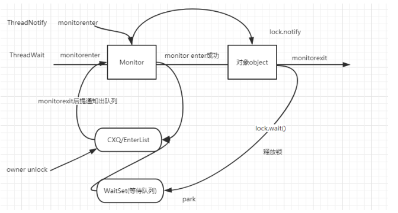

# wait和notify


> wait和notify是用来让线程进入等待状态以及使得线程唤醒的两个操作


## 代码演示

```java
public class ThreadWait extends Thread {

    private Object lock;

    public ThreadWait(Object lock) {
        this.lock = lock;
    }

    @Override
    public void run() {
        synchronized (lock) {
            System.out.println("开始执行 thread wait");
            try {
                lock.wait();
            } catch (InterruptedException e) {
                e.printStackTrace();
            }
            System.out.println("执行结束 thread wait");
        }
    }
}


public class ThreadNotify extends Thread {
    private Object lock;

    public ThreadNotify(Object lock) {
        this.lock = lock;
    }

    @Override
    public void run() {
        synchronized (lock) {
            System.out.println("开始执行 thread notify");
            lock.notify();
            System.out.println("执行结束 thread notify");
        }
    }
}


```


## wait 和 notify 的原理

> 调用wait方法
>
> 首先会获取监视器锁，获得成功以后，会让当前线程进入等待状态进入等待队列并且释放锁；
>
> 然后当其他线程调用notify或者notifyall以后，会选择从等待队列中唤醒任意一个线程，
>
> 而执行完notify方法以后，并不会立马唤醒线程，原因是当前的线程仍然持有这把锁，处于等待状态的线程无法获得锁。必须要等到当前的线程执行完按monitorexit指令以后，也就是锁被释放以后，处于等待队列中的线程就可以开始竞争锁了


> waitSet的放入entryList中



## wait 和 notify 为什么要先获取锁

>  wait方法的语义有两个，一个是释放当前的对象锁、另一个是使得当前线程进入阻塞队列， 而这些操作都和监视器是相关的，所以wait必须要获得一个监视器锁


> 而对于notify来说也是一样，它是唤醒一个线程，既然要去唤醒，首先得知道它在哪里？所以就必须要找到这个对象获取到这个对象的锁，然后到这个对象的等待队列中去唤醒一个线程。


