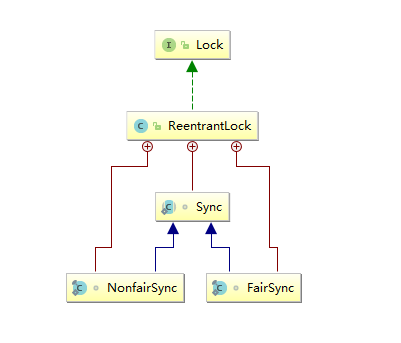
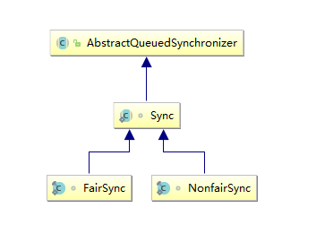
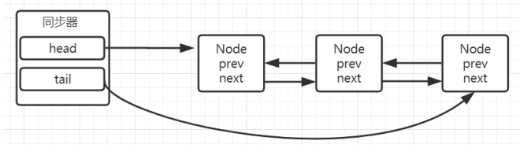
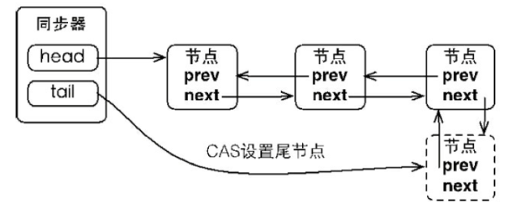
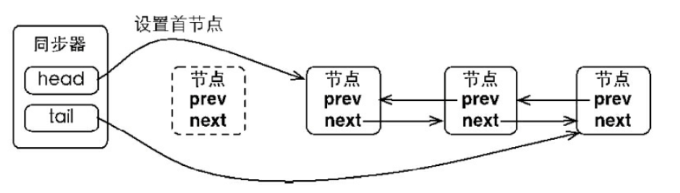
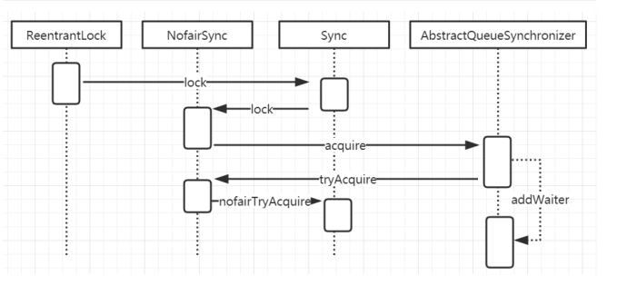

# 同步锁

> 锁是用来控制多个线程访问共享资源的方式，一般来说，一个锁能够防止多个线程同时访问共享资源，
> 在Lock接口出现之前，Java应用程序只能依靠synchronized关键字来实现同步锁的功能，在java5以后，增加了JUC的并发包且提供了Lock接口用来实现锁的功能，它提供了与synchroinzed关键字类似的同步功能，只是它比synchronized更灵活，能够显示的获取和释放锁。


# Lock和synchronized的简单对比

通过我们对Lock的使用以及对synchronized的了解，基本上可以对比出这两种锁的区别了。因为这个也是在面试过程中比较常见的问题

- 从层次上，一个是关键字、一个是类， 这是最直观的差异
- 从使用上，lock具备更大的灵活性，可以控制锁的释放和获取； 而synchronized的锁的释放是被动的，当出现异常或者同步代码块执行完以后，才会释放锁
- lock可以判断锁的状态、而synchronized无法做到
- lock可以实现公平锁、非公平锁； 而synchronized只有非公平锁

# Lock的初步使用

>  Lock是一个接口，核心的两个方法
>
> - **lock**
>
> - **unlock**
>
> 它有很多的实现
>
> - **ReentrantLock**
> - **ReentrantReadWriteLock**

 

  ```java
public interface Lock {
    void lock();
    void unlock();
    Condition newCondition();
    void lockInterruptibly() throws InterruptedException;
    boolean tryLock();
    boolean tryLock(long time, TimeUnit unit) throws InterruptedException;
}

public class ReentrantLock 
    	implements Lock, java.io.Serializable {}

public class ReentrantReadWriteLock
        implements ReadWriteLock, java.io.Serializable {｝


  ```

## ReentrantLock

> 重入锁，表示支持重新进入的锁，也就是说，如果当前线程t1通过调用lock方法获取了锁之后，再次调用lock，是不会再阻塞去获取锁的，直接增加重试次数就行了。

### ReentrantLock结构图





### ReentrantLock代码演示

```java

public class lockDemo {
    private static int count = 0;
    private static Lock lock = new ReentrantLock();

    public static void incr() {
        try {
            Thread.sleep(1);
        } catch (InterruptedException e) {
            e.printStackTrace();
        }
        lock.lock();
        count++;
        lock.unlock();

    }

    public static void main(String[] args) throws InterruptedException {
        for (int i = 0; i < 10000; i++) {
            new Thread(lockDemo::incr).start();
        }
        Thread.sleep(4000);
        System.out.println(count);
    }
}

```


## ReentrantReadWriteLock

>  我们以前理解的锁，基本都是排他锁，也就是这些锁在同一时刻只允许一个线程进行访问，而读写所在同一时刻可以允许多个线程访问，但是在写线程访问时，所有的读线程和其他写线程都会被阻塞。读写锁维护了一对锁，一个读锁、一个写锁; 一般情况下，读写锁的性能都会比排它锁好，因为大多数场景读是多于写的。在读多于写的情况下，读写锁能够提供比排它锁更好的并发性和吞吐量.


###ReentrantReadWriteLock代码演示

 ```java
public class RWLockDemo {
    static Map<String, Object> cacheMap = new HashMap<>();
    static ReentrantReadWriteLock rwl = new ReentrantReadWriteLock();
    static Lock read = rwl.readLock();
    static Lock write = rwl.writeLock();

    public static final Object get(String key) {
        System.out.println("开始读取数据");
        read.lock(); //读锁
        try {
            return cacheMap.get(key);
        } finally {
            read.unlock();
        }
    }

    public static final Object put(String key, Object value) {
        write.lock();
        System.out.println("开始写数据");
        try {
            return cacheMap.put(key, value);
        } finally {
            write.unlock();
        }
    }
}

 ```

> 在这个案例中，通过hashmap来模拟了一个内存缓存，然后使用读写所来保证这个内存缓存的线程安全性。
>
> 当执行读操作的时候，需要获取读锁，在并发访问的时候，读锁不会被阻塞，因为读操作不会影响执行结果。
>
> 在执行写操作是，线程必须要获取写锁，当已经有线程持有写锁的情况下，当前线程会被阻塞，只有当写锁释放以后，其他读写操作才能继续执行。
>
> 使用读写锁提升读操作的并发性，也保证每次写操作对所有的读写操作的可见性
>
> - 读锁与读锁可以共享
> - 读锁与写锁不可以共享（排他）
> -  写锁与写锁不可以共享（排他）


 # Lock的分析

## AQS

> Lock之所以能实现线程安全的锁
>
> 主要的核心是**AQS**(c),AbstractQueuedSynchronizer
>
> 提供了一个**FIFO**队列，可以看做是一个用来实现锁以及其他需要同步功能的框架。这里简称该类为				AQS。
>
> AQS的使用依**靠继承**来完成，子类通过继承自AQS并实现所需的方法来管理同步状态。例如常见的ReentrantLock，CountDownLatch等AQS的两种功能
>
> 从使用上来说，AQS的功能可以分为两种：**独占和共享**。
>
> 独占锁模式下，每次只能有一个线程持有锁，比如前面给大家演示的ReentrantLock就是以独占方式实现的互斥锁
>
> 共享锁模式下，允许多个线程同时获取锁，并发访问共享资源，比如ReentrantReadWriteLock。
>
>
>
> 很显然，独占锁是一种悲观保守的加锁策略，它限制了读/读冲突，如果某个只读线程获取锁，则其他读线程都只能等待，这种情况下就限制了不必要的并发性，因为读操作并不会影响数据的一致性。
>
> 共享锁则是一种乐观锁，它放宽了加锁策略，允许多个执行读操作的线程同时访问共享资源


> 总结：AQS ---->FIFO ---->靠继承---->独占(ReentrantLock)和共享(ReentrantReadWriteLock)
>
> 总结：线程包装NODE ----> 从head添加 ---->从tail添加


### AQS的内部实现

> 同步器依赖内部的同步队列（一个FIFO双向队列）来完成同步状态的管理，当前线程获取同步状态失败时，同步器会将当前线程以及等待状态等信息构造成为一个节点（Node）并将其加入同步队列，同时会阻塞当前线程，当同步状态释放时，会把首节点中的线程唤醒，使其再次尝试获取同步状态。

```java
static final class Node {
  int waitStatus; //表示节点的状态，包含cancelled（取消）；condition 表示节点在等待condition也就是在condition队列中
  Node prev; //前继节点
  Node next; //后继节点
  Node nextWaiter; //存储在condition队列中的后继节点
  Thread thread; //当前线程
}
```


> AQS类底层的数据结构是使用双向链表，是队列的一种实现。包括一个head节点和一个tail节点，分别表示头结点和尾节点，其中头结点不存储Thread，仅保存next结点的引用。

> compareAndSetTail()  添加节点到尾部
>
> compareAndSetHead() 添加节点到头部
>
>




> 当一个线程成功地获取了同步状态（或者锁），其他线程将无法获取到同步状态，转而被构造成为节点并加入到同步队列中，而这个加入队列的过程必须要保证线程安全，因此同步器提供了一个基于CAS的设置尾节点的方法：compareAndSetTail(Node expect,Nodeupdate)，它需要传递当前线程“认为”的尾节点和当前节点，只有设置成功后，当前节点才正式与之前的尾节点建立关联。



> 同步队列遵循FIFO，首节点是获取同步状态成功的节点，首节点的线程在释放同步状态时，将会唤醒后继节点，而后继节点将会在获取同步状态成功时将自己设置为首节点。




> 设置首节点是通过获取同步状态成功的线程来完成的，由于只有一个线程能够成功获取到同步状态，因此设置头节点的方法并不需要使用CAS来保证，它只需要将首节点设置成为原首节点的后继节点并断开原首节点的next引用即可

 

#### compareAndSet

> AQS中，除了本身的链表结构以外，还有一个很关键的功能，就是CAS，这个是保证在多线程并发的情况下保证线程安全的前提下去把线程加入到AQS中的方法,可以简单理解为乐观锁

```java
private final boolean compareAndSetHead(Node update) {
    return unsafe.compareAndSwapObject(this, headOffset, null, update);
}
```

> 这个方法里面首先，用到了unsafe类，(Unsafe类是在sun.misc包下，不属于Java标准。但是很多Java的基础类库，包括一些被广泛使用的高性能开发库都是基于Unsafe类开发的，比如Netty、Hadoop、Kafka等；Unsafe可认为是Java中留下的后门，提供了一些低层次操作，如直接内存访问、线程调度等)，然后调用了compareAndSwapObject这个方法

```java
    public final native boolean compareAndSwapObject(Object var1, long var2, Object var4, Object var5);

```

> 这个是一个native方法
>
> - 第一个参数为需要改变的对象
>
> - 第二个为偏移量(即之前求出来的headOffset的值)
>
> - 第三个参数为期待的值
>
> - 第四个为更新后的值

> 如果var2 == var4  ，那么就将var2的值，设置为var5.

>  unsafe.cpp

```c++
UNSAFE_ENTRY(jboolean, Unsafe_CompareAndSwapObject(JNIEnv *env, jobject unsafe, jobject
obj, jlong offset, jobject e_h, jobject x_h))
 UnsafeWrapper("Unsafe_CompareAndSwapObject");
 oop x = JNIHandles::resolve(x_h); // 新值
 oop e = JNIHandles::resolve(e_h); // 预期值
 oop p = JNIHandles::resolve(obj);
 HeapWord* addr = (HeapWord *)index_oop_from_field_offset_long(p, offset);// 在内存中的
具体位置
 oop res = oopDesc::atomic_compare_exchange_oop(x, addr, e, true);// 调用了另一个方法，实
际上就是通过cas操作来替换内存中的值是否成功
 jboolean success  = (res == e);  // 如果返回的res等于e，则判定满足compare条件（说明res应该为
内存中的当前值），但实际上会有ABA的问题
 if (success) // success为true时，说明此时已经交换成功（调用的是最底层的cmpxchg指令）
  update_barrier_set((void*)addr, x); // 每次Reference类型数据写操作时，都会产生一个Write
Barrier暂时中断操作，配合垃圾收集器
 return success;
UNSAFE_END
```

## ReentrantLock的实现原理分析

> 之所以叫重入锁是因为同一个线程如果已经获得了锁，那么后续该线程调用lock方法时不需要再次获取锁，也就是不会阻塞；
>
> 重入锁提供了两种实现
>
> - 一种是非公平的重入锁
>
> - 另一种是公平的重入锁
>
>
> 怎么理解公平和非公平呢？
>
> 如果在绝对时间上，先对锁进行获取的请求一定先被满足获得锁，那么这个锁就是公平锁
>
> 反之，就是不公平的。简单来说公平锁就是等待时间最长的线程最优先获取锁。

### 构造方法

#### 默认非公平锁

```java
public ReentrantLock() {
    sync = new NonfairSync();
}
```

#### 指定公平锁

```java
public ReentrantLock(boolean fair) {
    sync = fair ? new FairSync() : new NonfairSync();
}
```

#### 非公平锁的实现流程时序图




#### NonfairSync.lock

> compareAndSetState(0, 1)

```java
    static final class NonfairSync extends Sync {
        private static final long serialVersionUID = 7316153563782823691L;

        final void lock() {
            //现有线程获得锁
            if (compareAndSetState(0, 1))
                //保存当前线程
                setExclusiveOwnerThread(Thread.currentThread());
            else
                //已经有线程获得锁
                acquire(1);
        }

        protected final boolean tryAcquire(int acquires) {
            return nonfairTryAcquire(acquires);
        }
    }
```

##### compareAndSetState

> 通过cas算法去改变state的值，而这个state是什么呢？ 在AQS中存在一个变量state

> 对于ReentrantLock来说

> - 如果state=0表示无锁状态、

> -  果state>0表示有锁状态。
>
> 所以在这里，是表示当前的state如果等于0，则替换为1，如果替换成功表示获取锁成功了

> ReentrantLock是可重入锁，所以持有锁的线程可以多次加锁，经过判断加锁线程就是当前持有锁的线程时（即exclusiveOwnerThread==Thread.currentThread()），即可加锁，每次加锁都会将state的值+1，state等于几，就代表当前持有锁的线程加了几次锁;解锁时每解一次锁就会将state减1，state减到0后，锁就被释放掉，这时其它线程可以加锁；

##### AbstractQueuedSynchronizer.acquire

> 如果CAS操作未能成功，说明state已经不为0，此时继续acquire(1)操作,acquire是AQS中的方法 当多个线程同时进入这个方法时，首先通过cas去修改state的状态，如果修改成功表示竞争锁成功，竞争失败的，tryAcquire会返回false
>
> > 这个方法的主要作用是
> >
> > - 尝试获取独占锁，获取成功则返回，否则
> > - 自旋获取锁，并且判断中断标识，如果中断标识为true，则设置线程中断
> > - addWaiter方法把当前线程封装成Node，并添加到队列的尾部

```java
    public final void acquire(int arg) {
        if (!tryAcquire(arg) &&
            acquireQueued(addWaiter(Node.EXCLUSIVE), arg))
            selfInterrupt();
    }
```

###### tryAcquire

```java
        protected final boolean tryAcquire(int acquires) {
            return nonfairTryAcquire(acquires);
        }
```

###### nonfairTryAcquire

```java
        final boolean nonfairTryAcquire(int acquires) {
            final Thread current = Thread.currentThread();
            int c = getState();////获取当前的状态，前面讲过，默认情况下是0表示无锁状态
            if (c == 0) {
                if (compareAndSetState(0, acquires)) {////通过cas来改变state状态的值，如果更新成功，表示获取锁成功, 这个操作外部方法lock()就做过一次，这里再做只是为了再尝试一次，尽量以最简单的方式获取锁。
                    setExclusiveOwnerThread(current);
                    return true;
                }
            }
            else if (current == getExclusiveOwnerThread()) {////如果当前线程等于获取锁的线程，表示重入，直接累加重入次数
                int nextc = c + acquires;
                if (nextc < 0) //如果这个状态值越界，抛出异常；如果没有越界，则设置后返回true
                    throw new Error("Maximum lock count exceeded");
                setState(nextc);
                return true;
            }
            return false;//获取锁失败，返回false
        }
```


###### addWaiter

> Node mode（addWaiter(Node.EXCLUSIVE), arg)）
>
> - Node.EXCLUSIVE(独占)
> - static final Node SHARED = new Node(); （共享）

```java

private Node addWaiter(Node mode) {
    Node node = new Node(Thread.currentThread(), mode);////创建一个独占的Node节点,mode为排他模式
    Node pred = tail; //将最后一个阶段赋值给pred  // // tail是AQS的中表示同步队列队尾的属性，刚开始为null，所以进行enq(node)方法
    if (pred != null) {
        node.prev = pred;
        if (compareAndSetTail(pred, node)) {
            pred.next = node;
            return node;
        }
    }
    enq(node);// 如果队列为null或者CAS设置新的tail失败
    return node;
}
```

###### enq

> enq就是通过自旋操作把当前节点加入到队列中

```java
    private Node enq(final Node node) {
        for (;;) {////无效的循环，为什么采用for(;;)，是因为它执行的指令少，不占用寄存器
            Node t = tail;// 此时head, tail都为null
            if (t == null) { 
                if (compareAndSetHead(new Node()))
                    tail = head;
            } else {
                node.prev = t;
                if (compareAndSetTail(t, node)) {
                    t.next = node;
                    return t;
                }
            }
        }
    }
```


###### acquireQueued

