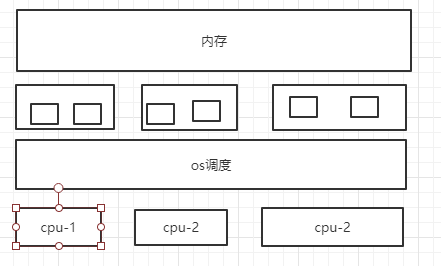
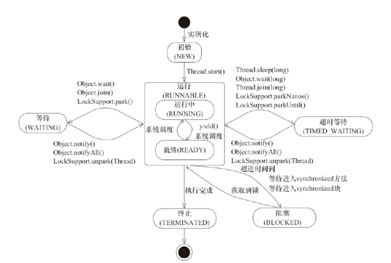

# java并发笔记

## 硬件架构模型图




## 什么时候使用多线程

1. 通过并行提高程序的性能
2. 网络等待，IO响应导致的延迟问题


## 应用多线程

### 继承Thread

> Thread 类本质上是实现了 Runnable 接口的一个实例，代表一个线程的实例。启动线程的唯一方法就是通过 Thread 类的 start()实例方法。start()方法是一个native 方法，它会启动一个新线程，并执行 run()方法。这种方式实现多线程很简单，通过自己的类直接 extend Thread，并复写 run()方法，就可以启动新线
> 程并执行自己定义的 run()方法


```java
public class MyThread extends Thread {

    public void run() {
        System.out.println("MyThread.run()");
    }

    public static void main(String[] args) {
        MyThread myThread1 = new MyThread();
        MyThread myThread2 = new MyThread();
        myThread1.start();
        myThread2.start();
    }
}
```


### 实现Runnable

```java
public class MyThread implements Runnable{

    public void run() {
        System.out.println("MyThread.run()");
    }

    public static void main(String[] args) {
        Thread myThread1 = new Thread(new MyThread());
        Thread myThread2 = new Thread(new MyThread());
        myThread1.start();
        myThread2.start();
    }
}
```


###  带返回值的ExecutorService、Callable、Future

>有的时候，我们可能需要让一步执行的线程在执行完成以后，提供一个返回值给到当前的主线程，主线程需要依赖这个值进行后续的逻辑处理，那么这个时候，就需要用到带返回值的线程了


```java
public class CallableDemo implements Callable<Boolean> {


    public static void main(String[] args) throws ExecutionException, InterruptedException {
        ExecutorService executorService =  Executors.newFixedThreadPool(6);
        Future<Boolean> future = executorService.submit(new CallableDemo());
        if(future.get()){
            System.out.println("线程执行成功");
        }
    }


    @Override
    public Boolean call() throws Exception {
        System.out.println("线程开始执行");
        System.out.println("线程执行结束");
        return true;
    }
}
```


## 并发编程基础

### 线程


#### 线程的状态

> BLOCKED:阻塞状态
>
> - 等待阻塞：运行的线程执行 wait 方法，jvm 会把当前线程放入到等待队列
>
> - 同步阻塞: 运行的线程在获取对象的同步锁时，若该同步锁被其他线程锁占
>   用了，那么 jvm 会把当前的线程放入到锁池中
>
> - 其他阻塞:运行的线程执行 Thread.sleep 或者 t.join 方法，或者发出了 I/O
>   请求时，JVM 会把当前线程设置为阻塞状态，当 sleep 结束、join 线程终止、
>   io 处理完毕则线程恢复

```java
public enum State {

        NEW,  //初始状态，线程被构建，但是还没有调用 start 方法

        RUNNABLE, //运行状态，JAVA 线程把操作系统中的就绪和运行两种状态统一称为“运行中”

        BLOCKED, //阻塞状态，表示线程进入等待状态,也就是线程因为某种原因放弃了 CPU 使用权，阻塞分为：等待阻塞，同步阻塞，其他阻塞

        WAITING, //等待状态

        TIMED_WAITING, //超时等待状态，超时以后自动返回

        TERMINATED; //终止状态，表示当前线程执行完毕
    }
```

 


#### 线程状态的演示

##### 代码演示

```java
public class ThreadStatus {

    public static void main(String[] args) {
        //TIME_WAITING
        new Thread(()->{
           while (true){
               try {
                   TimeUnit.SECONDS.sleep(1);
               } catch (InterruptedException e) {
                   e.printStackTrace();
               }
           }
        },"timewaiting").start();

        //WAITING，线程在 ThreadStatus 类锁上通过 wait 进行等待
        new Thread(()->{
            while(true){
                synchronized (ThreadStatus.class){
                    try {
                        ThreadStatus.class.wait();
                    } catch (InterruptedException e) {
                        e.printStackTrace();
                    }
                }
            }
        },"Waiting").start();

        //线程在 ThreadStatus 加锁后，不会释放锁
        new Thread(new BlockedDemo(),"BlockDemo-01").start();
        new Thread(new BlockedDemo(),"BlockDemo-02").start();

    }


    static class BlockedDemo extends Thread{
        public void run(){
            synchronized (BlockedDemo.class){
                while(true){
                    try {
                        TimeUnit.SECONDS.sleep(100);
                    } catch (InterruptedException e) {
                        e.printStackTrace();
                    }
                }
            }
        }
    }
}

```

##### 查看代码状态

通过相应命令显示线程状态 

> jps
>
> > 打开终端或者命令提示符，键入“jps”，（JDK1.5 提供的一个显示当前所有 java
> > 进程 pid 的命令），可以获得相应进程的 pid
>
> jstack
>
> > 根据上一步骤获得的 pid，继续输入 jstack pid（jstack 是 java 虚拟机自带的
> > 一种堆栈跟踪工具。jstack 用于打印出给定的 java 进程 ID 或 core file 或远程
> > 调试服务的 Java 堆栈信息）


#### 线程的停止

> 线程的启动过程大家都非常熟悉，但是如何终止一个线程，我相信绝大部分人在面试的时候被问到这个问题时，也会不知所措，不知道怎么回答。记住，线程的终止，并不是简单的调用 stop 命令去。虽然 api 仍然可以调用，但是和其他的线程控制方法如 suspend、resume 一样都是过期了的不建议使用，就拿 stop 来说，stop 方法在结束一个线程时并不会保证线程的资源正常释放，因此会导致程序可能出现一些不确定的状态。要优雅的去中断一个线程，在线程中提供了一个 interrupt 方法


##### interrupt  

###### interrupt的使用

>当其他线程通过调用当前线程的 interrupt 方法，表示向当前线程打个招呼，告诉他可以中断线程的执行了，至于什么时候中断，取决于当前线程自己。


> 线程通过 isInterrupted()来判断是否被中断。


  ```java
public class InterruptDemo {
    public  static  int count = 0;
    public static void main(String[] args) throws InterruptedException {
        Thread thread = new Thread(()->{
            while (!Thread.currentThread().isInterrupted()){
                count ++;
            }
            System.out.println(count);
        });
        thread.start();
        TimeUnit.SECONDS.sleep(2);
        thread.interrupt();
    }
}
  ```

> 这种通过标识位或者中断操作的方式能够使线程在终止时有机会去清理资源，而不是武断地将线程停止，因此这种终止线程的做法显得更加安全和优雅

 ###### 中断标识的线程复位

- Thread.interrupted


- 抛出 InterruptedException 异常


  ##### volatile控制线程的终止

